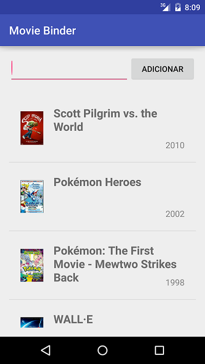
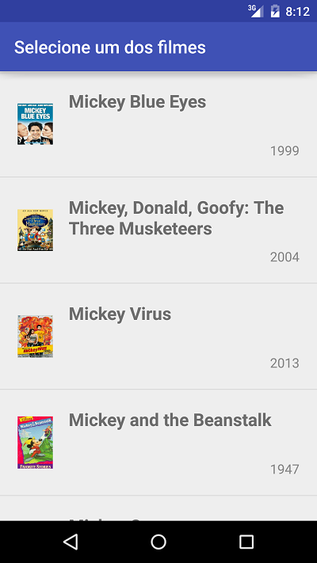

# Movie Binder with OMDb API

A simple Android application to register your favourite movies in your mobile!

<table>
	<tr>
		<td></td>
		<td></td>
	</tr>	
</table>

# Collaborating

To edit the code you just need to have Android Studio installed and properly configured. Since it uses Gradle, all the dependencies will be automagically downloaded for you. 

# Using it

In the dist folder there is a moviebinder-debug.apk. Just download it and install on your phone.

# Updates

I'll update this application, to improve the layout and add some more functionalities in the future.

# License

MIT